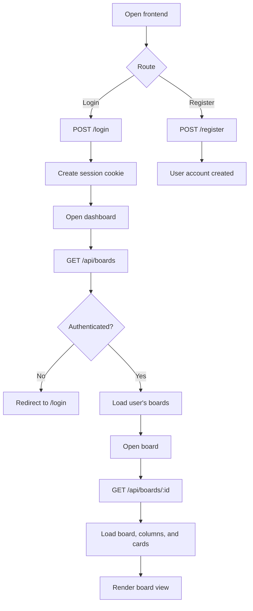

# Execution Flow

## Request Flow
1. Vite serves the React application.
2. React Router selects the register, login, dashboard, or board view.
3. Axios sends requests to the Express server with session credentials.
4. Express parses the request and routes it to the matching handler.
5. Protected routes run authentication middleware first.
6. Sequelize reads or writes PostgreSQL records.
7. The JSON response updates the relevant React page.

## Main Paths
- **Register:** form -> `POST /register` -> user record -> success response.
- **Login:** form -> `POST /login` -> session -> dashboard.
- **Board list:** dashboard -> `GET /api/boards` -> authenticated user's boards.
- **Board details:** board view -> `GET /api/boards/:id` -> board with columns and cards.
- **Logout:** `POST /logout` -> session destroyed -> login state ends.
